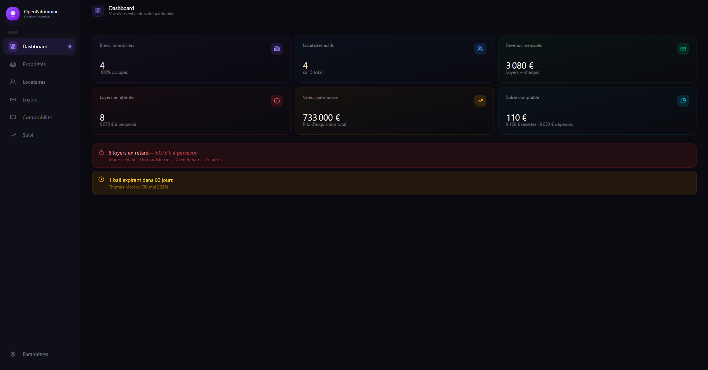
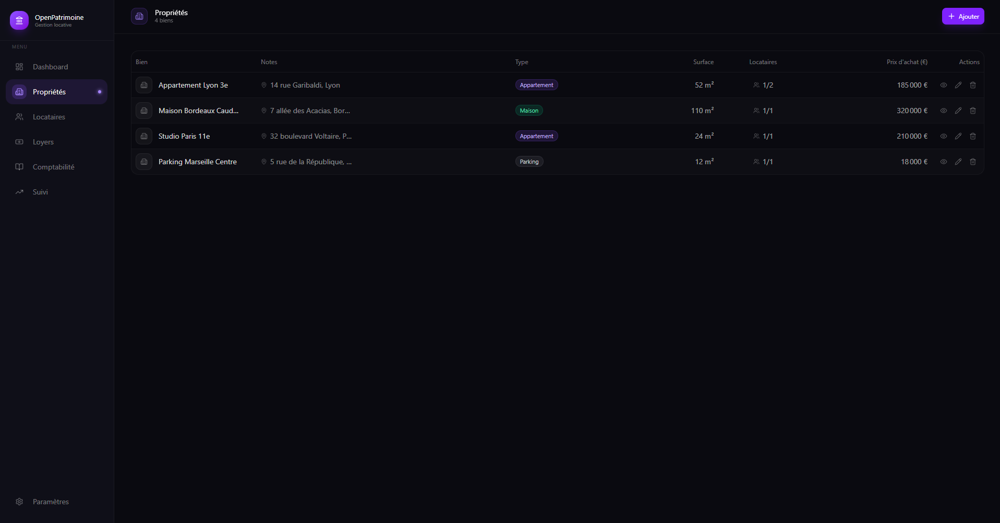
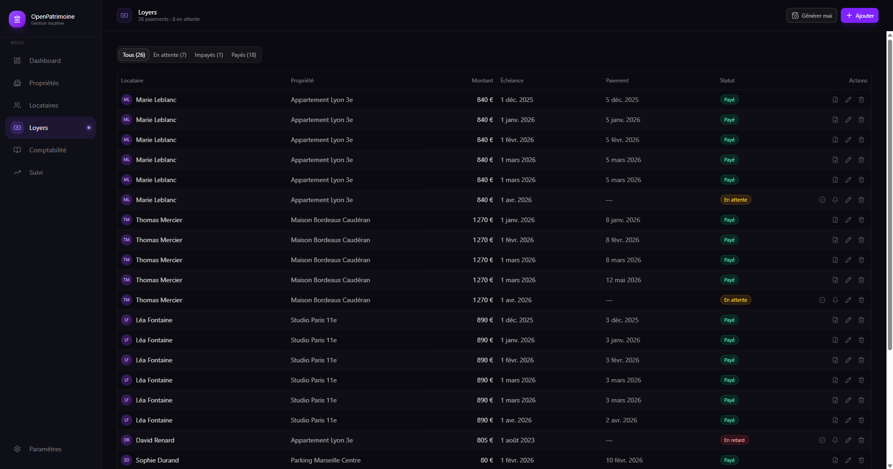
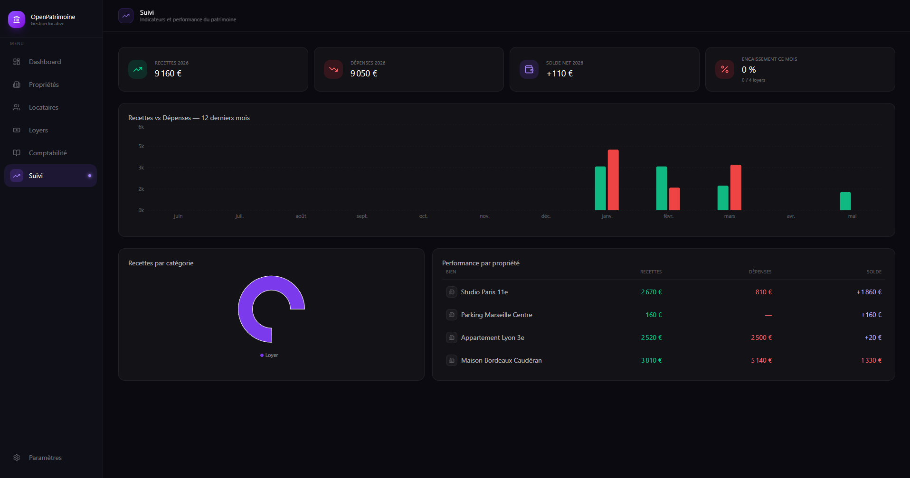

<div align="center">

<p><a href="README_en.md">🇬🇧 English</a> · <strong>🇫🇷 Français</strong></p>

<h1>OpenPatrimoine</h1>

<p><strong>Gérez votre patrimoine immobilier. Simplement. Localement.</strong></p>

<p>
  
  
  
  
</p>

</div>

---

## Aperçu

<div align="center">
  <video src="docs/videos/demo.gif" autoplay loop muted width="100%"></video>
</div>

<div align="center">
  
  
  
  
</div>

---

OpenPatrimoine est une application desktop pour les propriétaires bailleurs qui veulent garder le contrôle de leur patrimoine immobilier **sans abonnement, sans cloud, sans compromis sur la confidentialité**. Toutes vos données restent sur votre machine.

## Ce qu'elle fait

### Vos biens, en un coup d'œil
Centralisez toutes vos propriétés — appartements, maisons, parkings, locaux commerciaux. Chaque bien expose ses statistiques en temps réel : taux d'occupation, rendement brut, revenus annuels projetés.

### Locataires & contrats
Gérez l'historique complet de vos locataires avec les dates de bail, les loyers charges comprises, et l'état de chaque contrat. Générez des **quittances de loyer en PDF** en un clic, directement depuis l'application.

### Suivi des loyers
Visualisez le statut de chaque paiement mois par mois — payé, en attente, en retard. Générez automatiquement les lignes de loyer d'un mois entier pour tous vos locataires. Envoyez des rappels aux impayés via un courrier de relance pré-rédigé, prêt à copier.

### Comptabilité intégrée
Enregistrez toutes vos recettes et dépenses par bien : loyers perçus, travaux, charges de copropriété, taxes foncières, intérêts d'emprunt. Exportez votre comptabilité en **CSV** pour votre comptable ou votre déclaration fiscale.

### Suivi & analyse
Visualisez l'évolution mensuelle de vos recettes et dépenses sur des graphiques clairs. Identifiez vos meilleurs rendements, vos biens déficitaires, vos locataires à risque.

### Documents légaux
Générez les documents courants du bailleur français depuis l'application : quittances de loyer et courriers de relance.

---

## Pourquoi OpenPatrimoine ?

| | OpenPatrimoine | Excel/Sheets | Logiciels SaaS |
|---|---|---|---|
| **Prix** | Gratuit | Gratuit | 10–30 €/mois |
| **Données locales** | ✅ | ✅ | ❌ |
| **PDF & exports** | ✅ | Limité | ✅ |
| **Interface dédiée** | ✅ | ❌ | ✅ |
| **Sans abonnement** | ✅ | ✅ | ❌ |
| **Multi-biens** | ✅ | Manuel | ✅ |

---

## Disponible en français et en anglais

L'interface est entièrement disponible en **français** et en **anglais**, avec un changement instantané depuis les paramètres. Les documents légaux générés restent en français, conformément aux exigences réglementaires françaises.

---

## Installation

### Pré-compilé

Téléchargez le dernier installeur depuis les [Releases](https://github.com/NewNekoy/OpenPatrimoine/releases) :

- **Windows** → `OpenPatrimoine-x.x.x-setup.exe`
- **macOS** → `OpenPatrimoine-x.x.x.dmg`
- **Linux** → `.AppImage`, `.deb`, ou `.snap`

### Depuis les sources

```bash
# Cloner le dépôt
git clone https://github.com/NewNekoy/openpatrimoine.git
cd openpatrimoine

# Installer les dépendances
npm install

# Lancer en développement
npm run dev

# Compiler
npm run build:win    # Windows
npm run build:mac    # macOS
npm run build:linux  # Linux
```

---

## Stack technique

Construit avec des technologies modernes, sans compromis :

- **Electron 39** — application desktop native multi-plateforme
- **React 19 + TypeScript** — interface réactive et typée
- **Vite (electron-vite)** — build ultra-rapide
- **Tailwind CSS v4 + shadcn/ui** — design system cohérent, thème sombre
- **TanStack Query v5** — synchronisation état/données
- **Stockage JSON local** — aucune base de données externe, aucun serveur

---

## Confidentialité

OpenPatrimoine ne collecte aucune donnée. Zéro télémétrie. Zéro analytics. Zéro appel réseau. Vos données de propriétaires, vos locataires, vos finances — tout reste sur votre disque dur, dans votre dossier utilisateur local.

---

<div align="center">
  <sub>Fait pour les propriétaires bailleurs français qui préfèrent la sobriété à l'abonnement.</sub>
</div>
